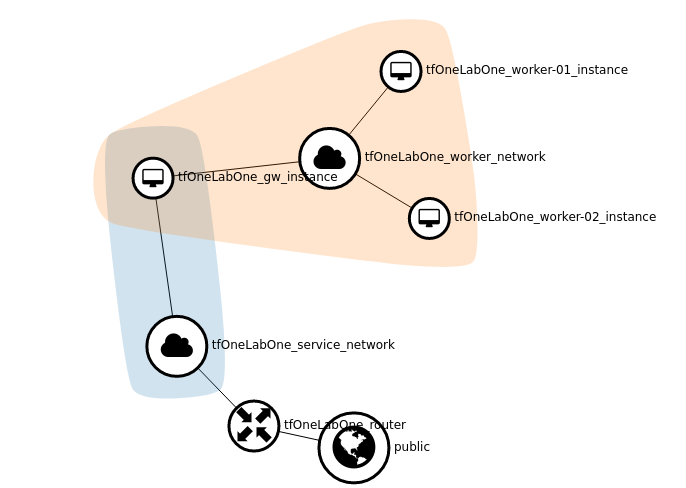

# Lab One
This lab creates a basic dual network infrastructure with one gateway instance and N worker instances ( set N to zero if you don't require any )

## Lab requirements on your client station :
 - packages : git, terraform, openstack-cli (optionnal)
 - {home}/.config/openstack/clouds.yaml holding your tenants credentials and URL

## Lab requirements on your tenant :
 - a public network with a FIP pool
 - enough vCPU, storage, secgroup, RAM

## How to :
Read and use terraform.tfvars.sample to set variables :
 - copy terraform.tfvars.sample to terraform.tfvars
 - edit terraform.tfvars variables as needed

To launch terraform
 - terraform init
 - terraform plan
 - terraform apply

 You may as well use multiple variable sets and state files to handle multiple labs on same or different clouds, see labCreate.sh as a sample.

## An example with six variables defined
All values are free except publicNetWork which has to match your tenant's public network name.

  - cloud = ...
  - flavorName = ...
  - pubKeyFile = ...
  - publicNetwork = "public"
  - infraName = "tfOneLabOne"
  - nbWorkers = 2

